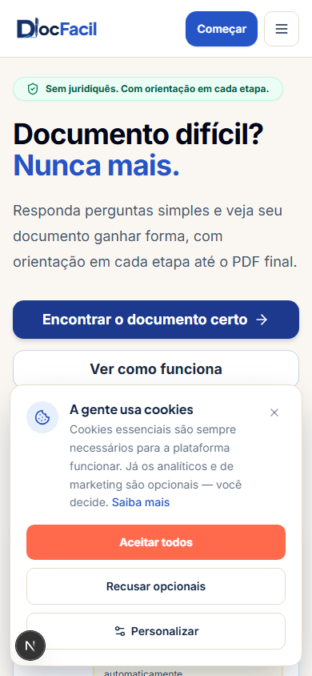
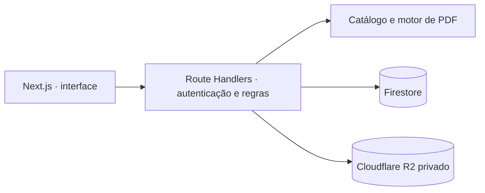

<div align="center">


# DocFácil

**Documentos prontos como numa conversa.**

Catálogo de contratos, declarações e procurações em português, com preenchimento guiado, prévia e PDF. Um produto da [RUON](https://ruon.dev).

</div>

## O produto hoje

O fluxo principal usa **nove modelos versionados no código**. A pessoa escolhe um documento, preenche os campos, confere a prévia e gera o PDF. Há acesso por conta Firebase, gestão dos documentos criados e pagamento avulso ou assinatura Pro pelo Mercado Pago. O servidor controla autorização, geração e armazenamento dos arquivos; os PDFs finais ficam em um bucket privado do Cloudflare R2.

| Parte | Implementação atual |
| --- | --- |
| Aplicação | Next.js 16, React 19, TypeScript, Tailwind CSS 4 |
| Identidade e dados | Firebase Authentication, Firestore, Firebase Admin e App Check |
| Documentos | Catálogo em `src/lib/modelos.ts`, motor de PDF com pdfmake, artefatos privados no R2 |
| Pagamentos | Mercado Pago para compra avulsa e assinatura Pro |
| Qualidade | Bun Test, ESLint, TypeScript, Playwright e emuladores Firebase |

O schema Prisma/SQLite permanece no repositório para o legado e migrações; o backend atual de documentos usa Firestore.

## AI Document Creation Pilot

Estamos desenvolvendo um piloto privado de criação documental com IA na branch [`feat/ai-document-creation`](https://github.com/Kauerc10/docfacil/tree/feat/ai-document-creation), acompanhado pelo [PR Draft #41](https://github.com/Kauerc10/docfacil/pull/41). O fluxo proposto vai do pedido em texto à triagem, coleta de dados, consulta a referências, edição e aprovação do rascunho e geração de PDF. A implementação nessa branch usa LangGraph, Groq, Firestore e o motor PDF existente.

**O piloto ainda não faz parte da `main` nem está liberado para uso.** A avaliação do modelo, as configurações de privacidade e a validação de integração precisam ser concluídas antes da liberação. O catálogo de modelos continua sendo o fluxo disponível nesta branch.

## Capturas da interface

| Desktop | Mobile |
| --- | --- |
|  |  |

As imagens mostram a página inicial e o fluxo do catálogo, não a interface do piloto de IA.

## Arquitetura



As rotas de documentos verificam a identidade no servidor. O cliente não decide cotas nem envia um template arbitrário para a finalização. Para mais detalhes, consulte a [arquitetura do backend](docs/backend-architecture.md).

## Executar localmente

### Pré-requisitos

- Bun e Node.js **22 ou superior**.
- Projeto Firebase e credenciais para os fluxos autenticados.
- Credenciais do R2 e do Mercado Pago para testar armazenamento e cobrança reais.
- Java para executar os testes com emuladores Firebase.

```bash
git clone https://github.com/Kauerc10/docfacil.git
cd docfacil
bun install
cp .env.example .env
bun run dev
```

No PowerShell, use `Copy-Item .env.example .env` no lugar de `cp`. Configure apenas as credenciais necessárias ao fluxo que pretende executar; veja os nomes e comentários em [`.env.example`](.env.example). O servidor local abre em `http://localhost:3000`. Nunca versione o arquivo `.env` nem credenciais reais.

### Comandos úteis

| Comando | Uso |
| --- | --- |
| `bun run dev` | Servidor de desenvolvimento |
| `bun run lint` | ESLint |
| `bun run typecheck` | Checagem de tipos |
| `bun run test` | Testes Bun |
| `bun run build:ci` | Build de produção para CI |
| `bun run test:e2e` | Playwright com emuladores Firebase |
| `bun run test:rules` | Regras do Firestore no emulador |

Os scripts Prisma (`db:*`) continuam disponíveis para o schema legado; não são uma etapa obrigatória do fluxo atual de documentos.

## Organização do código

```text
src/
├── app/api/                 # Rotas HTTP de documentos, pagamentos e IA
├── components/docfacil/     # Interface e fluxos da aplicação
├── lib/document-engine/     # Regras dos modelos determinísticos
├── lib/pdf/                 # Montagem e renderização de PDFs
└── lib/server/              # Autorização, persistência, IA e integrações
docs/                       # Arquitetura e operação
scripts/                    # Ferramentas de manutenção e avaliação
```

## Contribuição

Crie um branch a partir de `main`, use mensagens no padrão Conventional Commits observado no histórico (`feat(escopo): ...`, `fix(escopo): ...`) e abra um pull request. Para alterações em regras jurídicas, dados pessoais ou integrações de produção, descreva as decisões e os riscos no PR. Antes da revisão, execute as verificações pertinentes ao escopo e registre limitações de ambiente ou cenários ainda não avaliados.

## Licença e contato

Copyright © 2026 RUON. Todos os direitos reservados. Consulte [LICENSE](LICENSE). Contato: [kaue@ruon.dev](mailto:kaue@ruon.dev).
