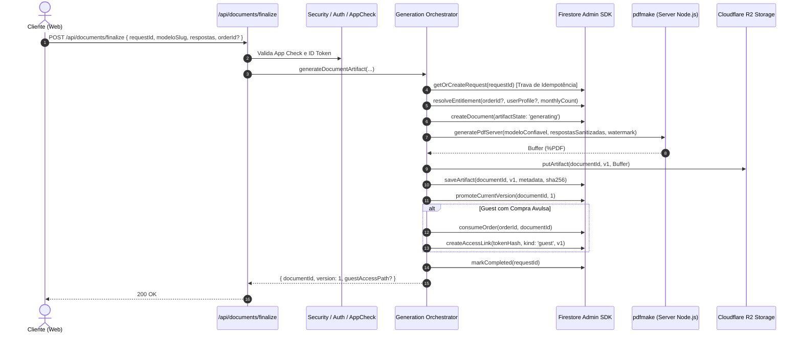
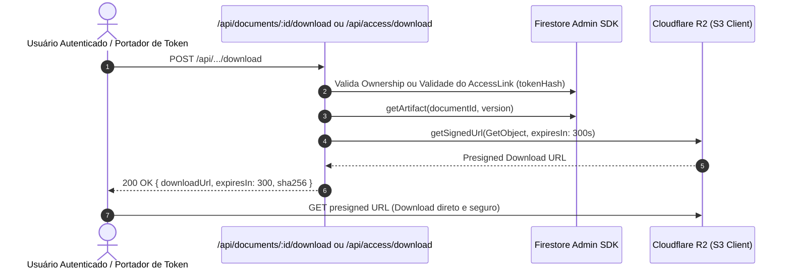

# Arquitetura de Backend: Documentos e Cloudflare R2

Este documento descreve a arquitetura server-side, o ciclo de vida dos artefatos em PDF, o modelo de segurança com Firebase Admin e Cloudflare R2, e os procedimentos operacionais do DocFacil.

---

## 1. Visão Geral

O DocFacil processa a geração, versionamento, compartilhamento e armazenamento seguro de documentos legais em PDF no lado do servidor (Node.js runtime no Next.js).

### Princípios Fundamentais
1. **Zero Client Trust:** Todas as decisões de negócio (autorização, validação de catálogo, controle de quota, verificação de pagamento e promoção de versão) são tomadas exclusivamente no backend.
2. **Private-by-Default:** Nenhum PDF é público ou servido diretamente por URLs estáticas. O acesso é intermediado por URLs pré-assinadas com tempo de expiração curto (300 segundos) e cabeçalhos estritos de privacidade (`Cache-Control: no-store`, `Referrer-Policy: no-referrer`, `X-Robots-Tag: noindex, nofollow`).
3. **Idempotência Estrita:** Toda solicitação de geração recebe um `requestId` único (UUIDv4) garantindo que falhas de rede ou retentativas não gerem múltiplos artefatos ou consumos duplicados de pedidos de compra.
4. **Armazenamento Privado R2:** Os PDFs gerados são armazenados no Cloudflare R2 com chaves versionadas (`documents/{documentId}/v{version}/document.pdf`).

---

## 2. Diagramas de Sequência e Arquitetura

### 2.1 Fluxo de Geração e Finalização (Guest & Authenticated)

### 2.2 Fluxo de Download Seguro

---

## 3. Matriz de Variáveis de Ambiente

| Variável | Tipo | Obrigatório em Prod | Descrição |
| :--- | :--- | :--- | :--- |
| `NODE_ENV` | `string` | Sim | Ambiente de execução (`production`, `development`, `test`). |
| `FIREBASE_PROJECT_ID` | `string` | Sim | ID do projeto Firebase. |
| `FIREBASE_CLIENT_EMAIL` | `string` | Sim (Server) | E-mail da Service Account Firebase Admin. |
| `FIREBASE_PRIVATE_KEY` | `string` | Sim (Server) | Chave privada da Service Account (formato PEM com quebras de linha). |
| `R2_ACCOUNT_ID` | `string` | Sim (Prod R2) | Cloudflare Account ID. |
| `R2_ACCESS_KEY_ID` | `string` | Sim (Prod R2) | R2 Access Key ID. |
| `R2_SECRET_ACCESS_KEY` | `string` | Sim (Prod R2) | R2 Secret Access Key. |
| `R2_BUCKET_NAME` | `string` | Sim (Prod R2) | Nome do bucket R2 (ex: `docfacil-pdfs`). |
| `R2_ENDPOINT` | `string` | Opcional | Endpoint customizado S3/R2. |
| `APP_CHECK_ENFORCED` | `boolean` | Opcional | Quando `true`, rejeita requisições sem token válido do App Check. |
| `ALLOW_DEMO_BILLING` | `boolean` | Não | Habilita provedor demo de checkout (bloqueado em `production`). |

---

## 4. Estrutura de Coleções no Firestore

- **`documents/{id}`**: Metadados do documento (`owner`, `modeloSlug`, `respostas`, `artifactState`, `currentVersion`). Escrita bloqueada para clients.
- **`documents/{id}/artifacts/{version}`**: Metadados de cada versão compilada em PDF (`objectKey`, `sha256`, `sizeBytes`, `watermarked`, `sourceHash`, `modelSnapshotHash`).
- **`access_links/{tokenHash}`**: Links mágicos e de compartilhamento revogáveis. O token puro não é gravado, apenas seu SHA-256.
- **`orders/{orderId}`**: Pedidos de compra avulsa de uso único (`status: pending | paid | consumed`).
- **`generation_requests/{requestId}`**: Registro de idempotência atômica para operações de geração e versionamento.
- **`users/{userId}`**: Perfil do usuário. Atualização do campo `plano` é bloqueada via Firestore Security Rules.

---

## 5. Semântica de Acesso e Links Revogáveis

1. **Guest Magic Link (`kind: guest`):**
   - Permanente até revogação explícita ou exclusão do documento.
   - Concede acesso de download à versão gerada no momento da compra.
   - Indexação bloqueada via cabeçalhos HTTP (`X-Robots-Tag: noindex, nofollow`).

2. **Authenticated Share Link (`kind: share`):**
   - Permanente até revogação explícita ou reemissão.
   - Pinned na versão compartilhada no momento da emissão.
   - Gerar um novo link de compartilhamento para o mesmo documento revoga automaticamente o anterior.
   - Links de compartilhamento não possuem TTL automático nesta versão; o campo opcional `expiresAt` permanece no schema apenas para compatibilidade futura.

3. **URL Pré-assinada R2 (S3 Presigned URL):**
   - Validade efêmera de **300 segundos** (5 minutos).
   - Gerada sob demanda após validação autoritativa do token de acesso ou ID token autenticado.

---

## 6. Checklist de Deploy e Produção

- [ ] **Service Account Firebase:** Gerar chave JSON no Firebase Console com permissões de Admin para Firestore, Auth e App Check.
- [ ] **Cloudflare R2 Bucket:** Criar bucket privado sem acesso público e gerar chaves de API com permissão de leitura/escrita.
- [ ] **Firestore Rules:** Executar `bun run firestore:rules` para aplicar as regras de segurança compiladas.
- [ ] **App Check:** Registrar domínio de produção no Firebase App Check (reCAPTCHA Enterprise ou v3).
- [ ] **Verificação CI:** Garantir que todos os checks passem:
  - `bun run test`
  - `bun run test:rules`
  - `bun run lint`
  - `bun run typecheck`
  - `bun run build:ci`
